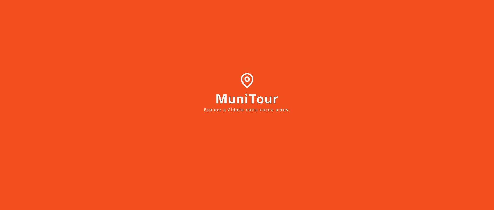
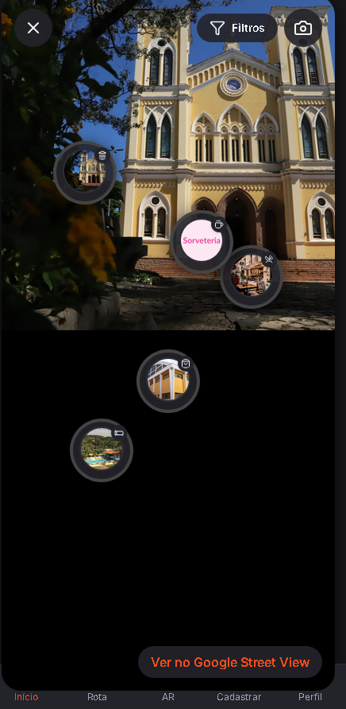

# MuniTour



> **Explore Mogi Mirim como nunca antes!**

MuniTour é uma plataforma interativa de turismo inteligente, criada para transformar a experiência de turistas e moradores ao explorar a cidade. Combinando tecnologia, cultura e acessibilidade, o MuniTour oferece recursos inovadores como Realidade Aumentada, visualização 360°, mapas interativos, linha do tempo histórica e integração oficial com a prefeitura e estabelecimentos locais.

---

## 🚀 Visão Geral

-   **Imersão total:** Visualize pontos turísticos em 360° e AR, descubra a história da cidade com linhas do tempo e explore rotas personalizadas.
-   **Acesso multiplataforma:** Use no celular, desktop ou em totens interativos espalhados pela cidade.
-   **Conteúdo validado:** Todas as informações são verificadas pela administração municipal.
-   **Foco em acessibilidade:** Interface responsiva, tooltips, legendas e navegação intuitiva.

---

## ✨ Funcionalidades em Destaque

|     | Funcionalidade               | Descrição breve                                |
| --- | ---------------------------- | ---------------------------------------------- |
| 🏛️  | Visualização 360°            | Explore locais turísticos em fotos imersivas   |
| 📚  | Linha do tempo histórica     | Descubra a evolução dos pontos de interesse    |
| 🗺️  | Mapa interativo              | Veja bairros, rotas e estabelecimentos no mapa |
| 🍽️  | Consulta de estabelecimentos | Gastronomia, lojas, cafés e hospedagem         |
| 📱  | Realidade Aumentada (AR)     | Veja marcadores interativos sobre imagem real  |
| 🛣️  | Planejamento de rotas        | Monte seu roteiro personalizado                |
| 👤  | Perfil do usuário            | Histórico, favoritos e conquistas              |
| 🏛️  | Integração municipal         | Conteúdo validado e oficial                    |
| 🖥️  | Totens interativos           | Acesso fácil em pontos estratégicos da cidade  |

---

## 🎬 Experimente Agora

1. **Clone o repositório:**
    ```bash
    git clone https://github.com/seu-usuario/MuniTour.git
    cd MuniTour
    ```
2. **Abra o protótipo:**

    - Navegue até `src/` e abra `index.html` em seu navegador favorito.
    - Para testar a experiência completa, utilize um navegador moderno (Chrome, Edge, Firefox).

3. **Google Maps:**

    - Para recursos de mapa, obtenha uma chave da API do Google Maps e substitua no arquivo `index.html` se necessário.

4. **Modo Totem:**
    - Experimente a interface para totens em `src/Totem/totem.html` (ideal para uso público em pontos turísticos).

---

## 📸 Exemplos Visuais

> 

---

## 📂 Estrutura do Projeto

```
MuniTour/
├── src/
│   ├── index.html           # Protótipo principal
│   ├── script.js            # Lógica da aplicação
│   ├── styles.css           # Estilos customizados
│   └── Totem/totem.html     # Interface para totens
├── docs/                    # Documentação
├── README.md                # Este arquivo
└── LICENSE                  # Licença MIT
```

---

## 👥 Equipe

-   Gabriel Danilo
-   Kaique Carvalho
-   Rogério Rodrigues

---

## 📄 Licença

Este projeto está sob a licença MIT. Veja o arquivo [LICENSE](LICENSE) para mais detalhes.

---

> _Projeto acadêmico desenvolvido para a disciplina de Engenharia de Software II – FATEC Mogi Mirim_
