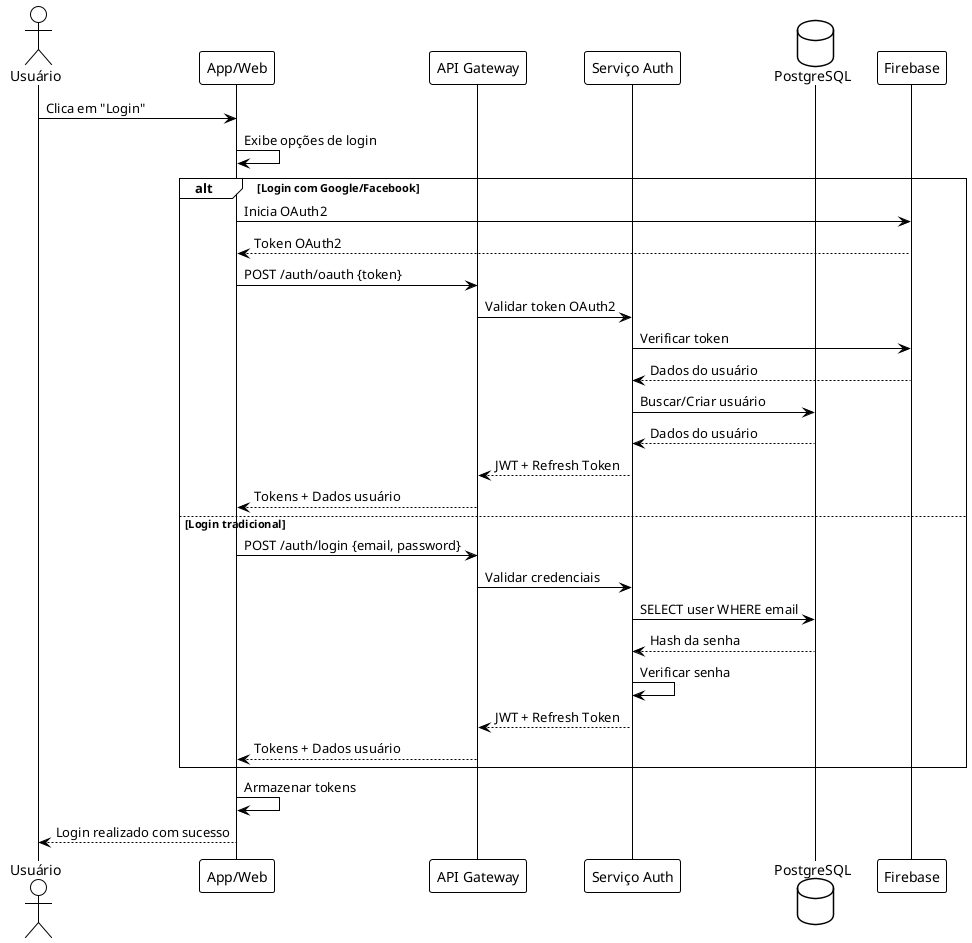
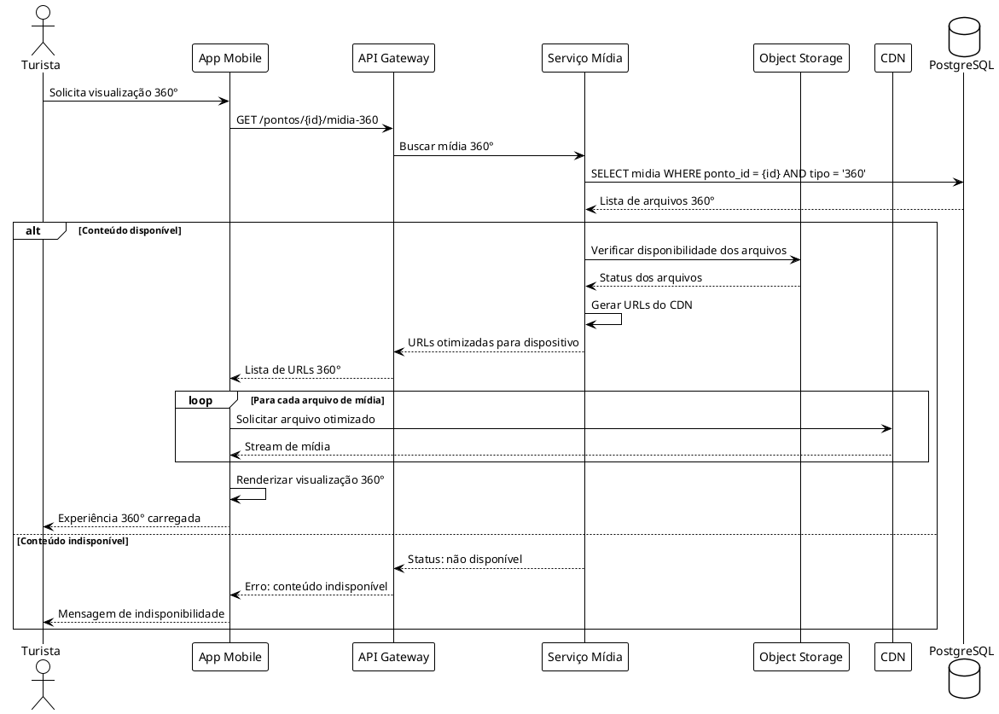
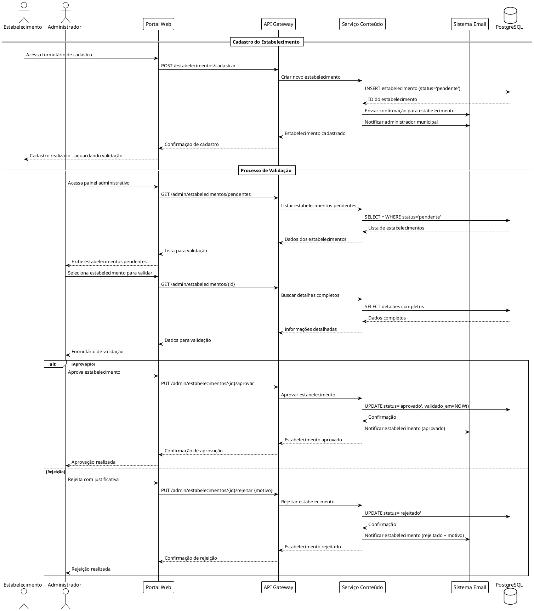
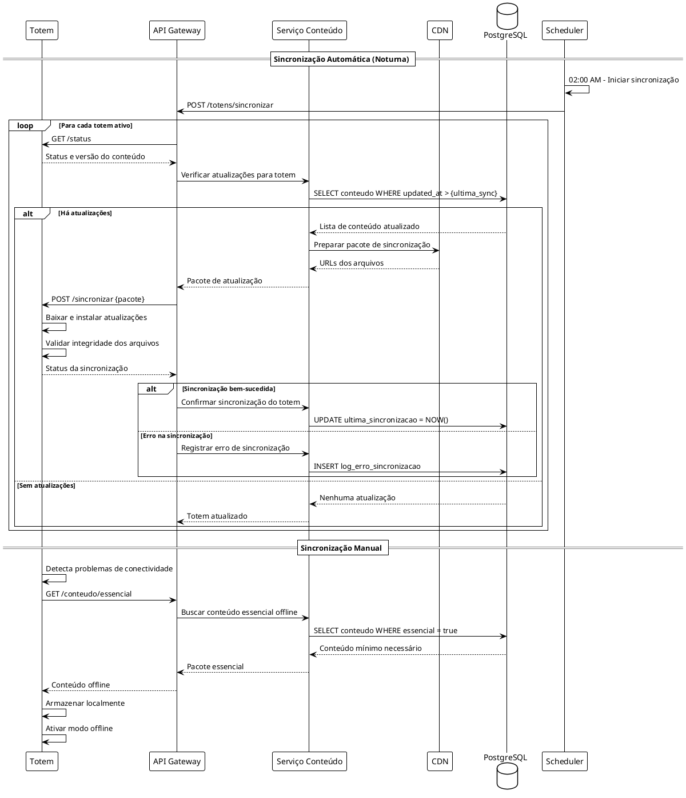

# Diagramas de Sequência - MuniTour

## Fluxo de Autenticação de Usuário

## Fluxo de Carregamento de Conteúdo 360°

## Fluxo de Validação de Estabelecimento

## Fluxo de Sincronização dos Totens

