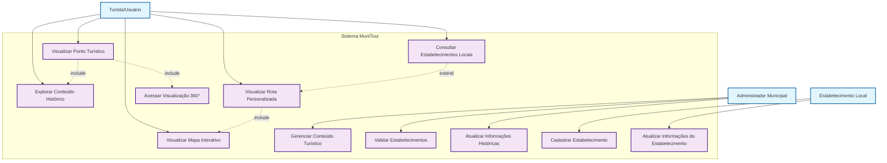
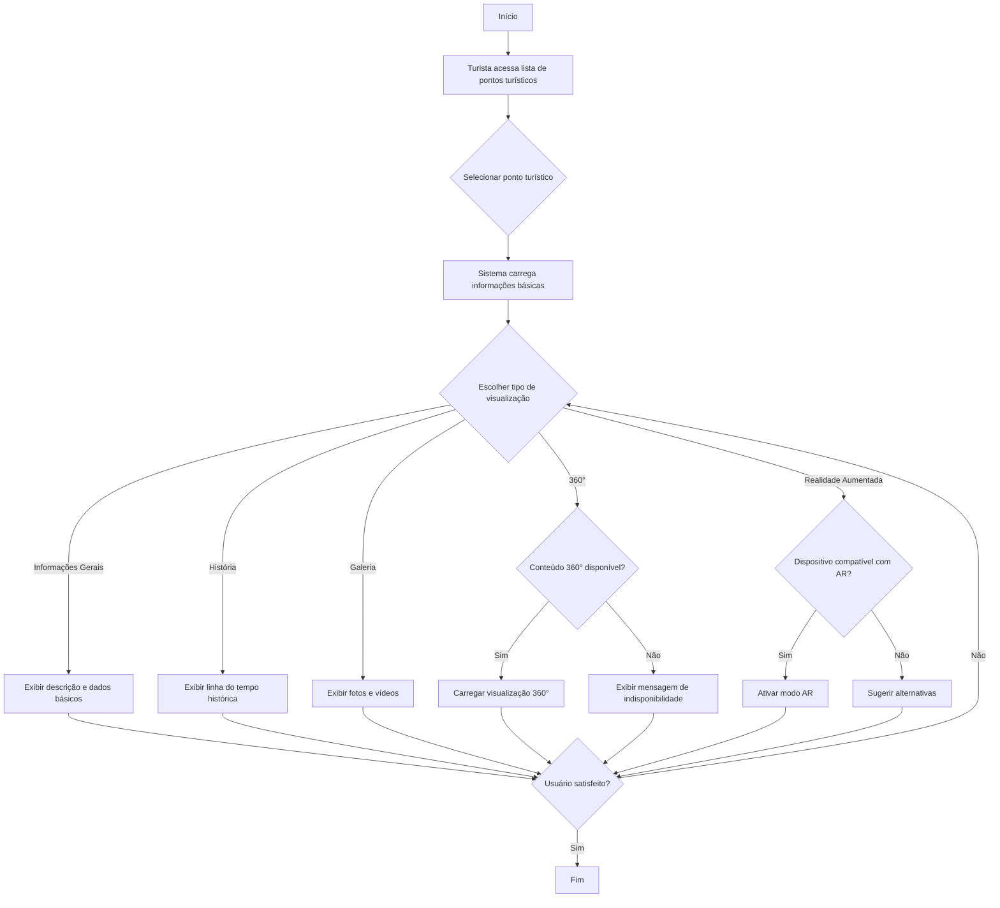
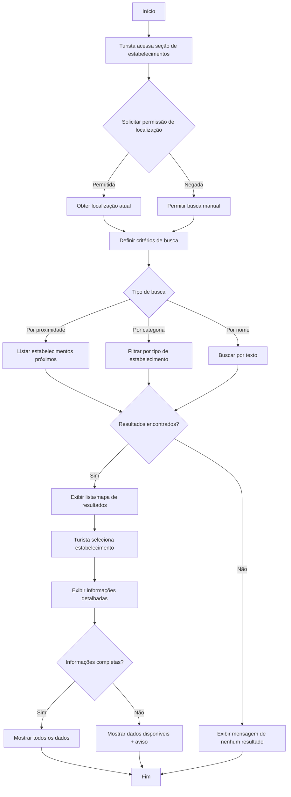
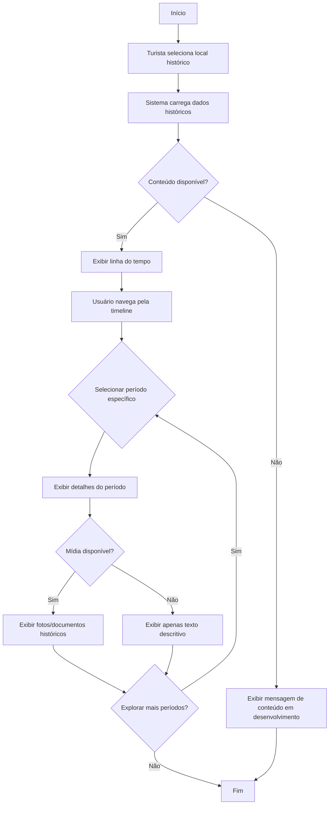
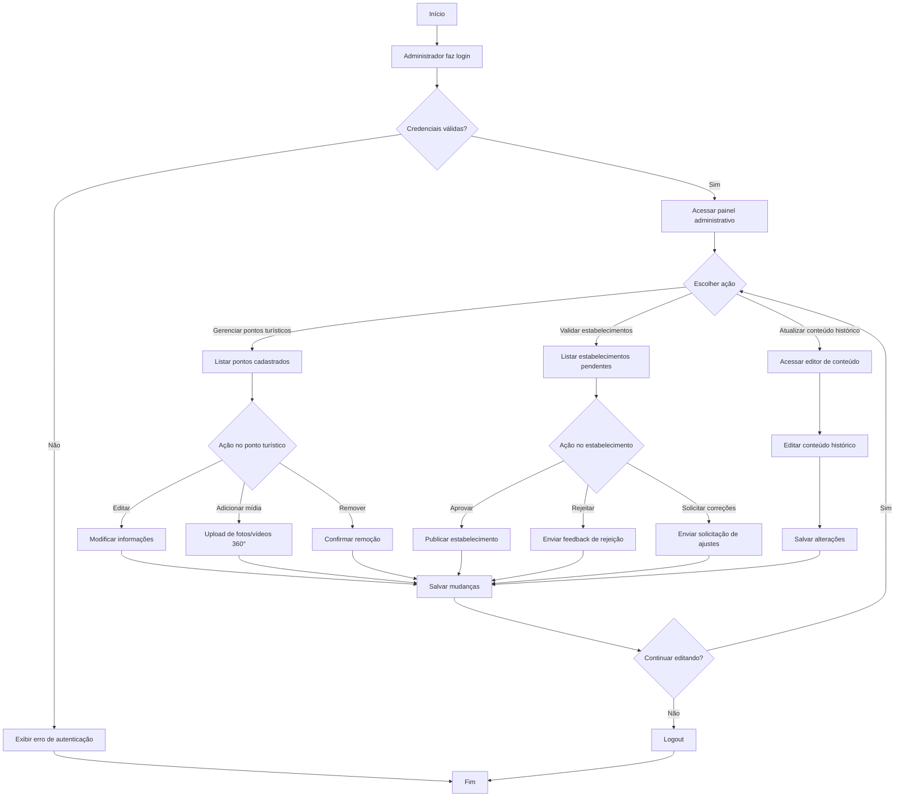

# Diagramas de Caso de Uso - MuniTour

## Diagrama de Caso de Uso Principal (Mermaid)

## Fluxo de Atividade: Visualizar Ponto Turístico

## Fluxo de Atividade: Consultar Estabelecimentos Locais

## Fluxo de Atividade: Explorar Conteúdo Histórico

## Fluxo de Atividade: Administração de Conteúdo

