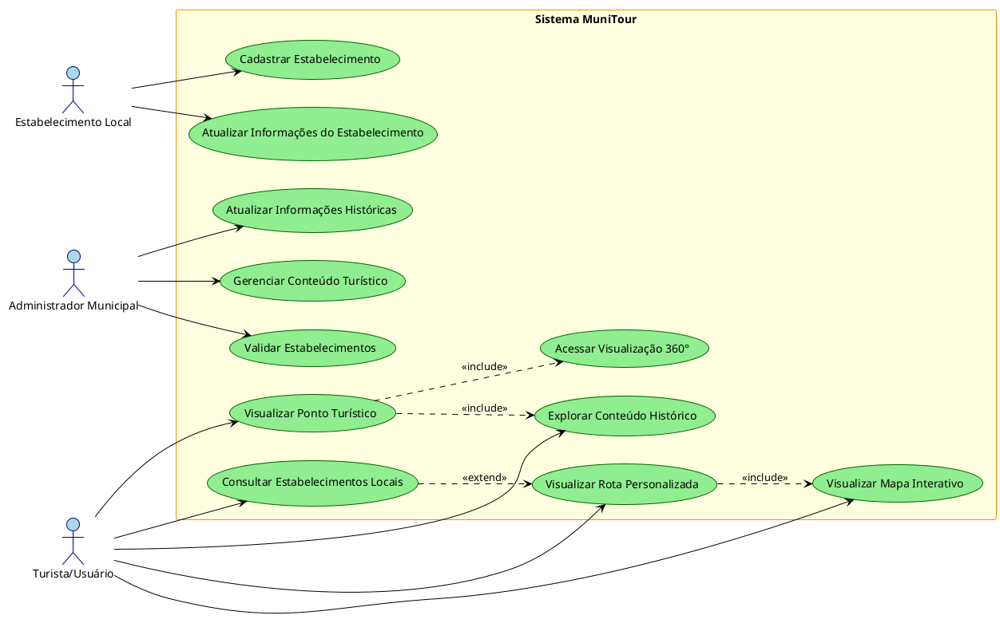
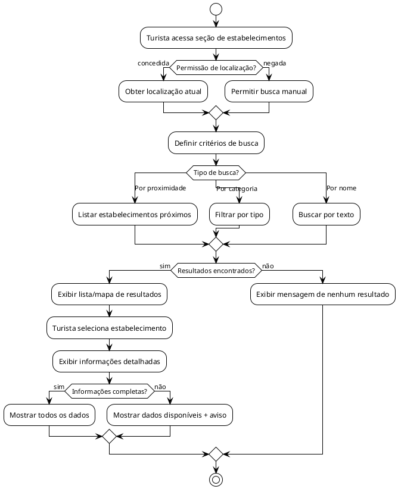
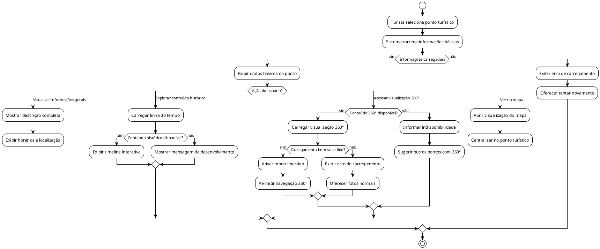
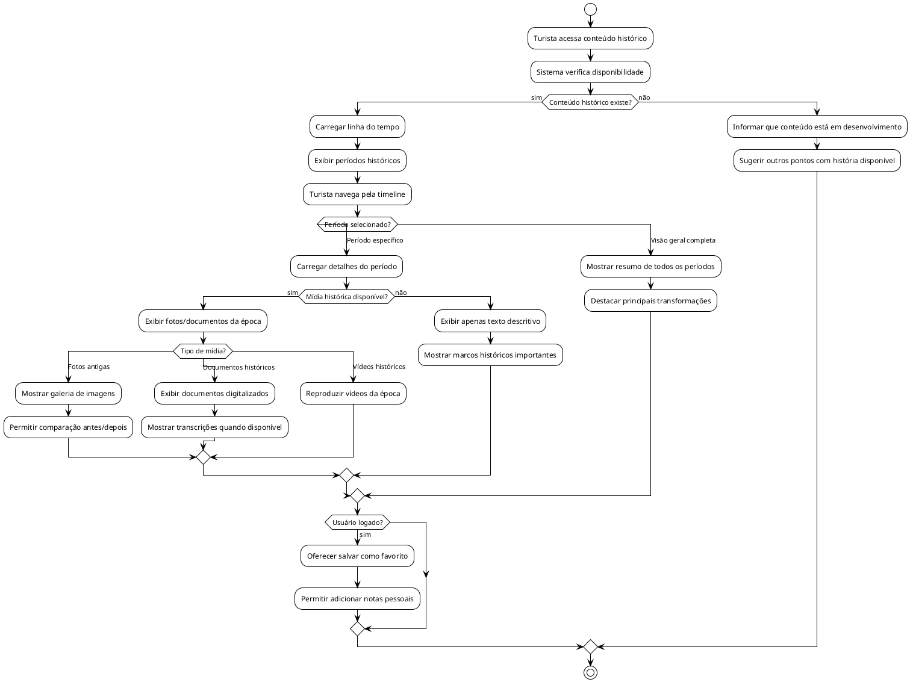
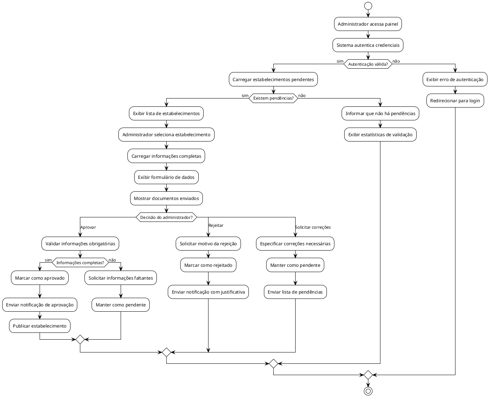
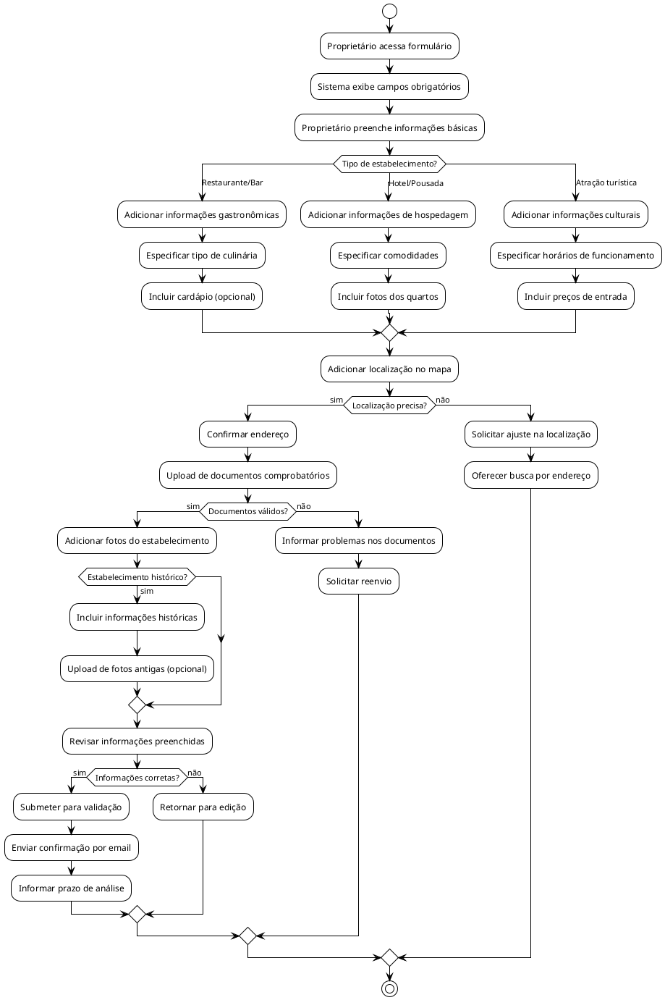
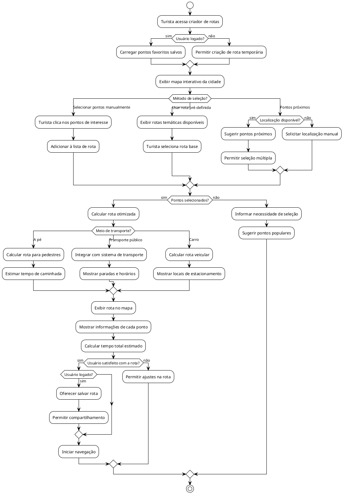
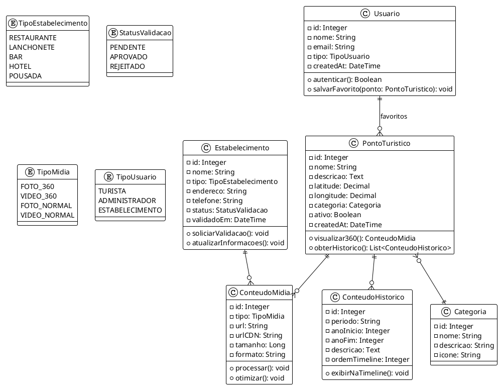
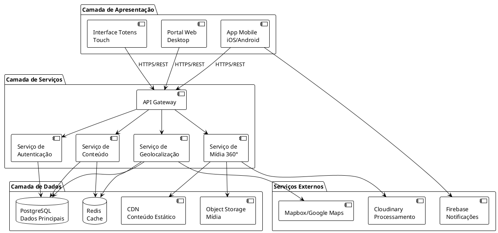
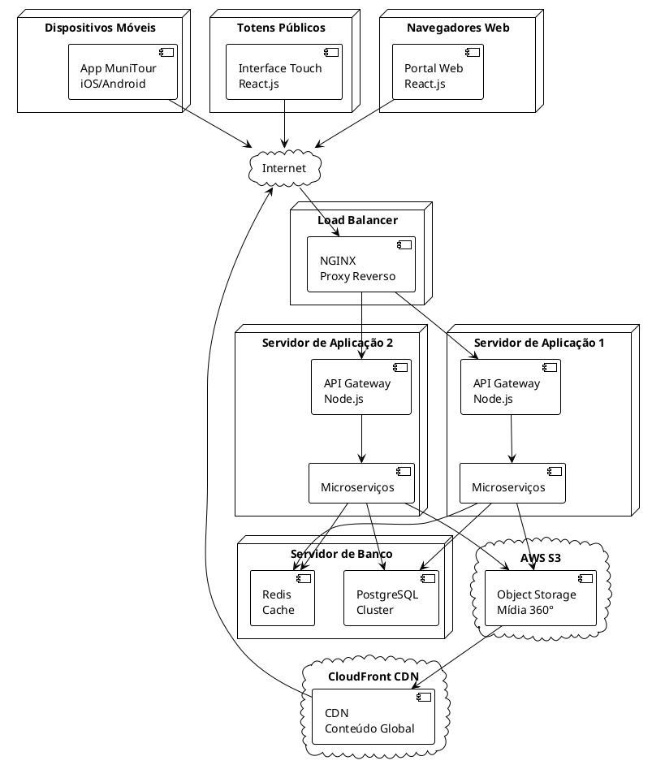

# Diagramas de Caso de Uso - MuniTour

## Diagrama de Caso de Uso Principal (PlantUML)

## Diagrama de Atividade: Consultar Estabelecimentos (PlantUML)

## Diagrama de Atividade: Visualizar Ponto Turístico (PlantUML)

## Diagrama de Atividade: Explorar Conteúdo Histórico (PlantUML)

## Diagrama de Atividade: Validar Estabelecimentos (Admin) (PlantUML)

## Diagrama de Atividade: Cadastrar Estabelecimento (PlantUML)

## Diagrama de Atividade: Visualizar Rota Personalizada (PlantUML)

## Diagrama de Classes: Modelo de Domínio (PlantUML)

## Diagrama de Componentes: Arquitetura do Sistema (PlantUML)

## Diagrama de Implantação (PlantUML)

